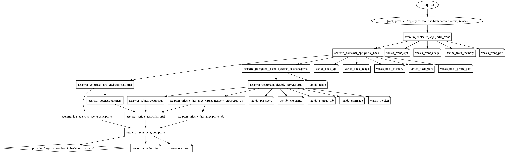
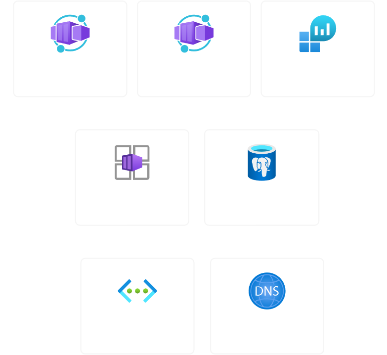

# portal-infra - L'infrastructure du portail pour tous les besoins d'Itavsa

## Sommaire

- [I - Contexte](#i---contexte)
- [II - Résultats](#ii---résultats)
- [III - Technologies utilisées](#iii---technologies-utilisées)

## I - Contexte

Afin de pouvoir vendre ses produits et services, Itavsa a besoin d'un site web.

C'est ici qu'intervient le portail qui, même s'il ne ressemble pour l'instant qu'à un site marchand comme un autre, pourra évoluer en quelque-chose de bien plus grand.

Le projet *portal-infra* s'inscrit dans ce sens en permettant de déployer l'infrastructure nécessaire au fonctionnement de [portal-front](https://github.com/Itavsa/portal-front) et [portal-back](https://github.com/Itavsa/portal-back) dans le cloud Azure.

## II - Résultats

Diagramme des ressources Terraform (obtenu grâce à la commande `terraform graph -type=plan | dot -Tpng -o graph.png` dans [terraform/azure](terraform/azure)) :

Diagramme des ressources Azure (obtenu sur Azure après déploiement) :

## III - Technologies utilisées

Afin de pouvoir déployer sur le Cloud [Azure](https://azure.microsoft.com/) toute l'infrastructure comprenant le [frontend](https://github.com/Itavsa/portal-front), le [backend](https://github.com/Itavsa/portal-back) et une base de données [PostgreSQL](https://www.postgresql.org/), j'ai utilisé [Terraform](https://www.terraform.io/).
